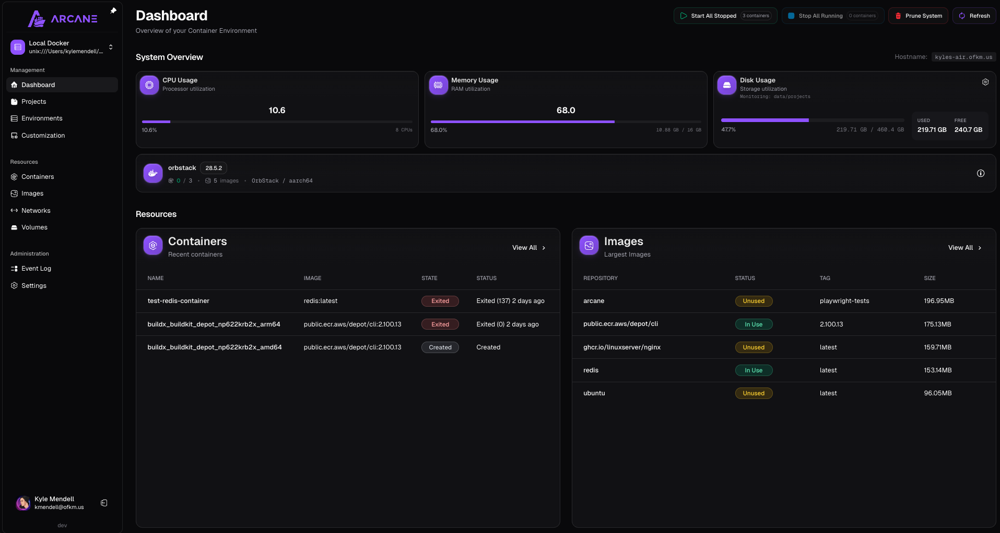

> [!IMPORTANT]
> All Arcane repos have moved to the [@getarcaneapp](https://github.com/getarcaneapp) org on GitHub.
>
> This means the images used for Arcane for all future releases (past 1.7.2) will use the following repositories:
>
> Arcane: `ghcr.io/getarcaneapp/arcane`
>
> Arcane Agent: `ghcr.io/getarcaneapp/arcane-headless`

  
  
Modern Docker Management, Designed for Everyone.

 

## Documentation

For setup instructions, configuration details, and development guides, visit the **[official documentation site](https://getarcane.app)**.

## Tagging Scheme for Go Modules

Arcane releases are tagged repo-wide as `vX.Y.Z`. To provide stable versions for nested Go modules, we also create module tags:

- `cli/vX.Y.Z`
- `types/vX.Y.Z`

Module tags are for Go tooling only and do not trigger CI releases (only `v*.*.*` tags do).

Examples:

- `go install github.com/getarcaneapp/arcane/cli@cli/vX.Y.Z`
- `go get github.com/getarcaneapp/arcane/types@types/vX.Y.Z`

## Sponsors

This project is supported by the following amazing people:

  

## Security & Transparency

View the Software Bill of Materials (SBOM) for Arcane at **[getarcane.app/sbom](https://getarcane.app/sbom)**.

## Translating

Help translate Arcane on Crowdin: https://crowdin.com/project/arcane-docker-management

Thank you for checking out Arcane! Your feedback and contributions are always welcome.

